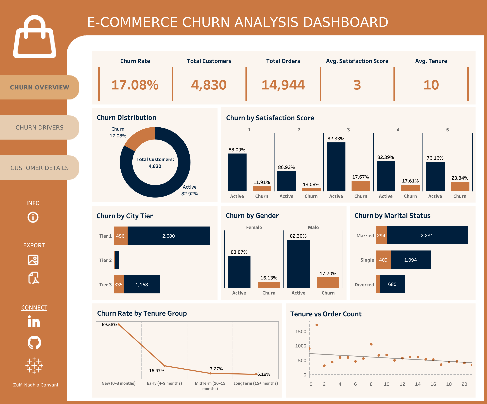

# E-COMMERCE CUSTOMER CHURN ANALYSIS AND PREDICTION
This group final project presents a machine learning–based churn prediction model for an e-commerce platform, leveraging features from five behavioral domains: demographics, engagement, transactions, platform preference, and satisfaction. Multiple classification models were benchmarked and optimized through hyperparameter tuning, with the best model selected and evaluated using test set metrics and feature importance analysis. The project uncovers patterns behind customer disengagement and identifies high-risk customers, enabling earlier churn detection, data-driven decisions, better retention planning, and more efficient marketing spend. The final model provides an interpretable, data-driven tool to support targeted retention strategies and improve business outcomes.

---

## I. BUSINESS UNDERSTANDING

### **Context**  
Customer churn—when users stop using a service—is a major challenge in e-commerce, leading to revenue loss, higher acquisition costs, and reduced customer lifetime value. Retaining customers is significantly more cost-effective than acquiring new ones. This project uses historical data and machine learning to predict churn risk and help stakeholders implement targeted retention strategies.

### **Problem Statement**  
The company faces rising customer inactivity, threatening revenue and marketing efficiency. Key questions include identifying who will churn, understanding predictive behaviors, and detecting churn risk early. Without predictive insights, marketing budgets may be wasted and valuable customers lost. The problem is framed as a binary classification: churn (`1`) or not (`0`).

### **Goals**  
- Identify customers likely to churn early for timely intervention.  
- Provide data-driven insights to support stakeholder decisions.  
- Lower churn rates through improved retention strategies.  
- Focus marketing efforts on high-risk customer segments to optimize budget.

### **Analytical Approach**  
Develop a supervised machine learning classifier using customer demographics, behavior, and transactions. Prioritize minimizing false negatives (missed churners) with metrics like F2-score, Recall, and PR-AUC. Deliver interpretable, actionable outputs to support retention efforts.

### **Scope and Limitations**  
Scope includes modeling churn from structured historical data, analyzing key churn drivers, and providing retention insights. Limitations involve missing external factors, unclear churn definitions and timing, assumptions on feature units, class imbalance, and a predictive—not explanatory—model. Despite these, the model offers a solid foundation for churn risk assessment and retention strategy support.

---

## II. DATA EXPLORATION AND PREPARATION
This phase covers data understanding, data cleaning, and exploratory data analysis (EDA) conducted for both business and machine learning purposes, as well as data preprocessing to prepare the dataset for modeling. The dataset contains 5,630 rows and 20 columns, including 19 features related to customer demographics, behavior, and transactions, plus the target variable **Churn**.

The data cleaning process includes handling missing values, converting incorrect data types, removing duplicate data, resolving inconsistent data, and addressing outliers based on domain knowledge.

During data preprocessing, the following steps were applied:

- **Scaling (Robust Scaler):** Applied to numeric features such as `Tenure`, `WarehouseToHome`, `HourSpendOnApp`, `OrderAmountHikeFromlastYear`, `NumberOfDeviceRegistered`, `NumberOfAddress`, `CouponUsed`, `OrderCount`, `DaySinceLastOrder`, and `CashbackAmount`.

- **Encoding:**
  - One-hot encoding for nominal categorical features: `PreferredLoginDevice`, `PreferredPaymentMode`, `Gender`, `MaritalStatus`, and `PreferedOrderCat`.
  - Ordinal encoding for ordered categorical features: `CityTier` and `SatisfactionScore`.
 
- **Passthrough** (no transformation): `CustomerID` and `Complain`.

- **Feature Engineering and Binning:**
  - Created new behavioral features including `RecencyRatio`, `IsActiveUser`, and `UnhappyCustomer`.
  - Binned `Tenure` into four ordered categories:  
    - New (0–3 months)  
    - Early (3–9 months)  
    - MidTerm (9–15 months)  
    - LongTerm (>15 months)  
  with ordinal encoding applied to preserve order.

---

## III. MODELING AND EVALUATION
This chapter covers building a classification model to predict e-commerce customer churn. It includes model benchmarking, handling class imbalance, hyperparameter tuning, and selecting the best model. The final model is explained, evaluated with key metrics, and analyzed for feature importance and business impact to ensure practical value.

### **1. Benchmark Model**  
Benchmarking compares ten classification algorithms under identical preprocessing and evaluation settings to establish baseline performance for predicting e-commerce customer churn. All models were integrated into a uniform pipeline with consistent scaling, encoding, and stratified sampling to ensure fair comparison based solely on model characteristics. Each was trained on the training set and evaluated on a fixed test set using churn-relevant classification metrics: **F2‑Score**, **Recall**, **PR‑AUC**, **F1‑Score**, **Precision**, **ROC‑AUC**, and **Accuracy**. The models range from linear (Logistic Regression), to non-parametric (K-Nearest Neighbors, Decision Tree), and ensemble methods (Bagging, Random Forest, AdaBoost, Gradient Boosting, XGBoost, LightGBM, CatBoost), balancing predictive power, interpretability, and robustness to class imbalance.

### **2. Model Optimization and Selection**  

- **Class Imbalance Handling:**  
  SMOTE-ENN was applied during cross-validation to balance classes, significantly improving recall and F2-Score, especially for ensemble models like CatBoost and Gradient Boosting.

- **Hyperparameter Tuning:**  
  Randomized search enhanced performance primarily in tree-based models, while simpler models saw moderate gains and Bagging remained largely stable.

- **Best Model Selection:**  
  CatBoost delivered top validation and test performance, achieving the **highest F2-score**, which was the prioritized metric for this project to emphasize capturing high-risk churn customers. This indicates strong robustness and readiness for deployment in churn prediction.

### **3. Model Diagnostics and Interpretation**  

- **Feature Importance & Model Explainability**  
  SHAP analysis revealed key churn drivers: low tenure, complaint history, low satisfaction, inactivity, fewer devices/addresses, lower-tier city, and single status. These insights enhance model transparency and help target specific customer segments like silent churners.

- **Model Generalization & Overfitting Analysis**  
  The CatBoost model demonstrated strong generalization on test data with high recall (94.9%) and F2-Score (~0.90), and ROC-AUC (0.98), indicating no overfitting and robust predictive performance suitable for deployment.

- **Confusion Matrix & Error Segmentation**  
  False negatives were 6.4% of churners, mainly active and satisfied customers representing passive churn, suggesting a gap in detecting subtle disengagement. False positives remained manageable, supporting efficient intervention strategies.

- **Threshold Adjustment & Risk Trade-off**  
  Optimal classification threshold was confirmed at 0.5, balancing recall and precision to maximize churn detection while controlling false alarms. This threshold supports cost-effective retention campaigns with strong ROI by capturing ~95% of churners with limited unnecessary actions.

---

## IV. CONCLUSION AND RECOMMENDATION

### **Conclusion**   

1. **Modeling Perspective**  
This project developed a robust, production-ready churn prediction model with CatBoost as the best performer after benchmarking, imbalance handling (SMOTE-ENN), and tuning.
Highlights:

    - **Strong Performance Across Metrics:**  
      CatBoost achieved strong test metrics prioritizing recall and balanced precision, including F2-Score 0.8987, Recall 0.9490, Precision 0.7413, F1-Score 0.8324, PR-AUC 0.8955, ROC-AUC 0.9765, and Accuracy 0.9379, outperforming alternatives.
    
    - **Ready for Deployment:**  
      Packaged in a scalable, modular pipeline with preprocessing, balancing, and optimized hyperparameters for seamless production use.
    
    - **Explainability & Insights:**  
      SHAP revealed key churn drivers (tenure, satisfaction, inactivity, complaints), aiding targeted retention.
    
    - **Optimized Threshold & Scalability:**  
      Default threshold 0.5 balances recall and precision, with pipeline designed for large datasets and retraining.

2. **Business Perspective**  
The project transformed high churn challenges into actionable solutions, providing strategic value:

    - **Targeted Retention:**  
      Individual churn probabilities enable focused interventions, replacing broad campaigns.
    
    - **Proactive Insights:**  
      Behavioral patterns identify silent churn risks for earlier action.
    
    - **Operational Integration:**  
      Scores support segmentation, trigger campaigns, and CRM integration for automated retention.
  
    - **Cost-Effective ROI:**  
      High recall (~95%) with manageable false positives (~26%) delivers efficient retention and foundation for a Retention Intelligence System.

### **Recommendation**   

1.  **Model Utilization Perspective**  
The CatBoost churn prediction model is ready for operational deployment, with key strategies to maximize impact:

    - **Pilot Testing:**  
      Implement gradual rollout via A/B testing on a limited customer segment to validate effectiveness and integration.
    
    - **Production Integration:**  
      Deploy using batch scoring, API services, or serialized pipelines, ensuring identical preprocessing in production.
    
    - **Threshold Flexibility:**  
      Maintain default threshold at 0.5 but allow adjustment based on budget, risk appetite, and retention goals.
    
    - **Monitoring & Retraining:**  
      Continuously monitor performance; retrain if recall drops >10% or data distribution shifts occur.
    
    - **Cross-Functional Collaboration:**  
      Coordinate data engineering, marketing, and management teams for smooth adoption and sustained value.

2. **Business Strategy Perspective**  
The project provides actionable insights to reduce churn and optimize retention spending:

    - **Risk-Based Segmentation:**  
      Use churn probabilities to prioritize high-risk customers for targeted retention offers.
    
    - **Early Intervention:**  
      Address customers showing early churn signals—short tenure, low satisfaction, inactivity—before disengagement escalates.
    
    - **Customer Experience Enhancement:**  
      Personalize incentives, improve app usability, and speed complaint resolution to boost loyalty.
    
    - **Promotion & Fulfillment Optimization:**  
      Refine coupon distribution, improve logistics in high-risk regions, and encourage reliable payment methods over COD.
    
    - **Dynamic Strategy Adjustment:**  
      Regularly track churn trends and adjust campaigns and resource allocation accordingly.

---

## REFERENCES

- **Fader, P. S., & Hardie, B. G. S. (2013).** *RFM and CLV: Using customer lifetime value for marketing strategies*. *Journal of Marketing Analytics, 1(3–4), 105–119.*  
- **Koehrsen, W., et al. (2020).** *Comparison of the CatBoost Classifier with Other Machine Learning Methods*. *International Journal of Advanced Computer Science and Applications, 11(11).*  
  [https://doi.org/10.14569/IJACSA.2020.0111190](https://doi.org/10.14569/IJACSA.2020.0111190)  
- **Kumar, V., & Reinartz, W. (2016).** *Customer Relationship Management: Concept, Strategy, and Tools* (3rd ed.). Springer.  
- **Verbraken, T., Verhoef, P. C., & de Ruyter, K. (2014).** *A Novel Profit Maximizing Metric for Measuring Classification Performance of Customer Churn Prediction Models*.  
  [https://www.researchgate.net/publication/261296259_A_Novel_Profit-Maximizing_Metric_for_Measuring_Classification_Performance_of_Customer_Churn_Prediction_Models](https://www.researchgate.net/publication/261296259_A_Novel_Profit-Maximizing_Metric_for_Measuring_Classification_Performance_of_Customer_Churn_Prediction_Models)  
- **Verma, A. (2023).** *E-commerce Customer Churn Analysis and Prediction* [Data set]. Kaggle.  
  [https://www.kaggle.com/datasets/ankitverma2010/ecommerce-customer-churn-analysis-and-prediction](https://www.kaggle.com/datasets/ankitverma2010/ecommerce-customer-churn-analysis-and-prediction)  

---

## PROJECT DEMO

**Streamlit App:** [E-Commerce Churn Prediction App](https://ecommercechurnapp-groupalpha.streamlit.app/)  
Input customer attributes to predict churn probability.

**Tableau Dashboard:** [E-Commerce Churn Analysis Dashboard](https://public.tableau.com/app/profile/znadhiac/viz/E-CommerceChurnAnalysisDashboard_17746364684840/ChurnOverview)  
Interactive data exploration and churn pattern visualization.

---

## TOOLS USED

- **Python:** Main programming language for data cleaning, preprocessing, modeling, and evaluation.  
- **Pandas and NumPy:** Data manipulation and numerical operations.  
- **Scikit-learn:** Model benchmarking, hyperparameter tuning, and evaluation metrics.  
- **Matplotlib and Seaborn:** Data visualization and diagnostic plots (residuals, feature importance).  
- **SHAP:** Model interpretability and feature impact analysis.  
- **Jupyter Notebook:** Interactive development and documentation environment. 
- **Tableau:** Data exploration, dashboarding, and visual analytics.  
- **Streamlit:** Web app framework for deploying interactive machine learning models.

---  

## CONTRIBUTORS  
- Zulfi Nadhia Cahyani (https://github.com/znadhiac)  
- Liswatun Naimah (https://github.com/Liswatunnaimah)  
- Aldino Dian Mandala Putra (https://github.com/aldino9112)  
